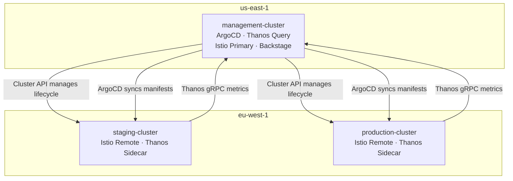
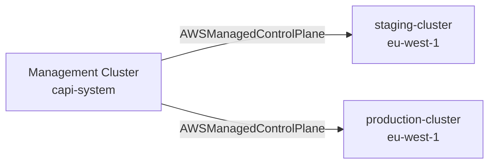
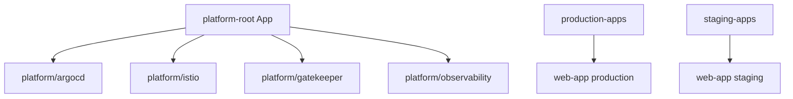
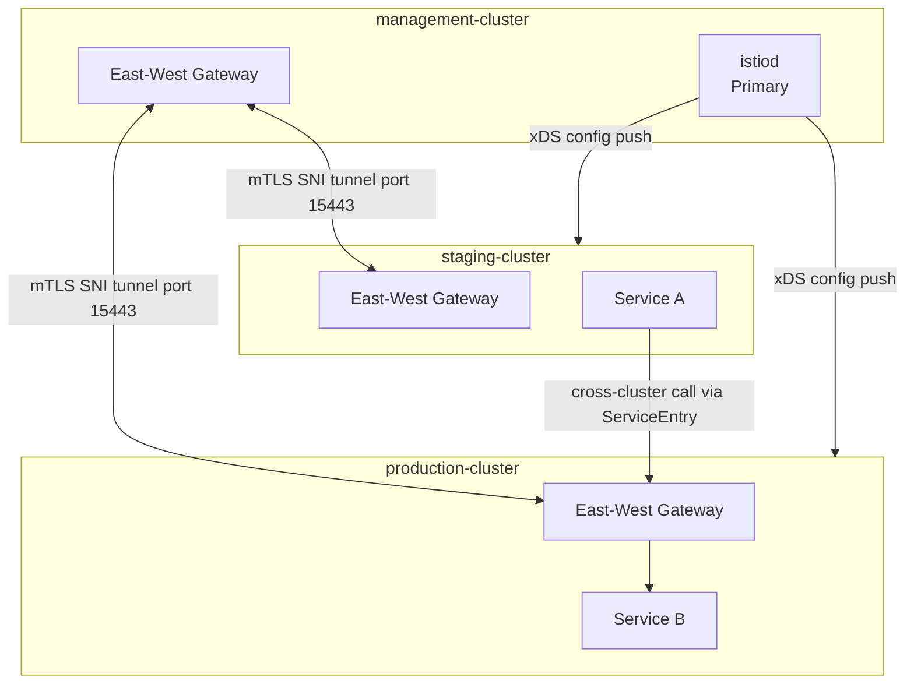
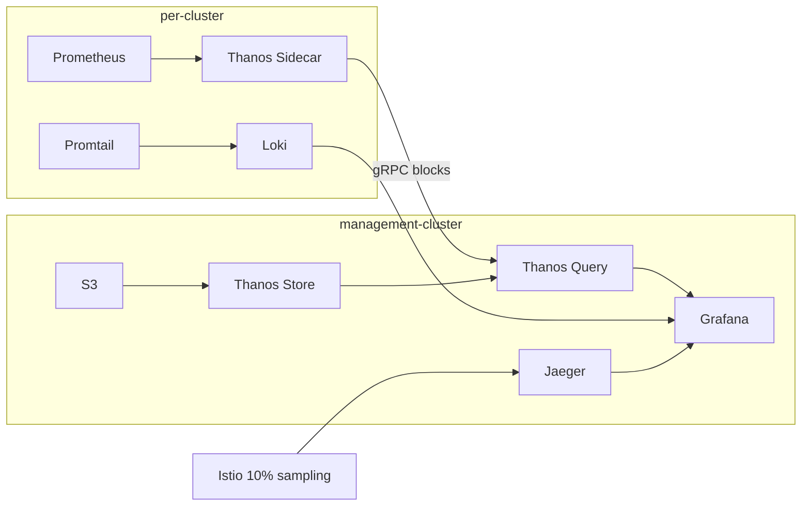
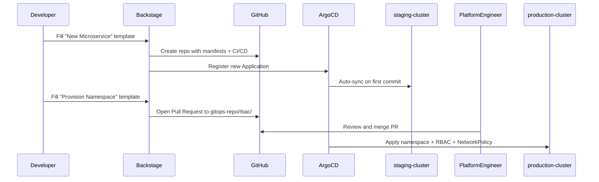

# Architecture Document — Multi-Cluster Kubernetes Platform

## 1. Overview

This document describes the architecture of an enterprise-grade Internal Developer Platform (IDP) built on Kubernetes. The platform manages three EKS clusters across two AWS regions, providing centralized GitOps-based deployment, multi-cluster service mesh networking, federated observability, policy enforcement, and developer self-service.

---

## 2. Cluster Topology

| Cluster | Region | Role |
|---------|--------|------|
| `management-cluster` | `us-east-1` | Control-plane: ArgoCD, Thanos Query, Grafana, Backstage, Istio primary istiod |
| `staging-cluster` | `eu-west-1` | Pre-production workloads; Istio remote; Thanos sidecar; Promtail |
| `production-cluster` | `eu-west-1` | Production workloads; Istio remote; Thanos sidecar; Promtail |

**Design rationale:** Separating the management cluster from workload clusters ensures a workload failure cannot affect the control plane. It allows stricter change controls on platform tooling independently of application deployments.

---

## 3. Infrastructure as Code

All clusters use a **shared reusable Terraform module** (`infra/terraform/modules/eks-cluster/`). Each environment calls this module with environment-specific variables. This eliminates configuration drift — a security patch is applied once and inherited by all clusters.

Each cluster gets its own non-overlapping VPC CIDR to support future peering:

| Cluster | VPC CIDR | Region |
|---------|----------|--------|
| management | 10.0.0.0/16 | us-east-1 |
| staging | 10.1.0.0/16 | eu-west-1 |
| production | 10.2.0.0/16 | eu-west-1 |

---

## 4. Cluster Federation (Cluster API)

Cluster API (CAPI) with the AWS provider manages workload cluster lifecycles from the management cluster.

**Why Cluster API over KubeFed?** KubeFed is archived and no longer maintained. Cluster API is the current Kubernetes community standard, handles full cluster lifecycle (create, upgrade, scale, delete), and is provider-agnostic.

---

## 5. GitOps Control Plane (ArgoCD — App-of-Apps)

A single `kubectl apply -f platform-root-app.yaml` bootstraps the entire platform. ArgoCD auto-syncs on every Git merge. No manual `kubectl apply` is needed post-bootstrap.

**Promotion workflow:**
1. Developer commits a change to a feature branch
2. CI (GitHub Actions) builds and pushes image, updates image tag in `gitops-repo/`
3. ArgoCD detects the change and syncs staging automatically
4. Platform engineer approves production sync (or it auto-syncs on merge to main)

---

## 6. Service Mesh (Istio — Primary-Remote)

**Why primary-remote over multi-primary?** A single istiod is simpler to operate — one place to manage certificates, one place for proxy status, one place for config. Multi-primary requires synchronising two control planes and is harder to debug. Primary-remote is the recommended starting point.

**mTLS:** A global `PeerAuthentication` in `istio-system` enforces `STRICT` mTLS mesh-wide. All clusters share a common root CA, establishing a single trust domain (`mesh1`).

**Traffic management:**
- Normal: 80% local (us-east-1), 20% eu-west-1 via `localityLbSetting`
- Failover: Outlier detection ejects unhealthy eu-west-1 endpoints; traffic shifts to us-east-1 automatically (~45s)
- Canary: `VirtualService` routes 90% to `v1`, 10% to `v2`; `x-canary: true` header forces `v2`

---

## 7. Observability

| Component | Purpose |
|-----------|---------|
| Prometheus + Thanos Sidecar | Per-cluster metrics; 2h blocks uploaded to S3 |
| Thanos Query | Global metrics view across all clusters + S3 history |
| Loki + Promtail | Centralised log aggregation from every node |
| Jaeger | Distributed tracing via OTLP; Istio sends 10% of spans |
| Grafana | Single UI: Thanos + Loki + Jaeger datasources pre-configured |

**Why Thanos over Cortex/Mimir?** Thanos sidecar requires zero changes to existing Prometheus — it runs alongside it and uploads blocks. Cortex and Mimir require a dedicated ingestion pipeline, adding operational complexity that is unjustified at this scale.

**Why Loki over EFK?** Loki indexes only metadata (labels), not log content, making it dramatically cheaper to operate at scale. It integrates natively with Grafana, avoiding a separate Kibana deployment. EFK is better suited when full-text search of log bodies is a primary requirement.

---

## 8. Policy Enforcement (OPA Gatekeeper)

Gatekeeper runs on all three clusters. Three policies are enforced at admission time:

| Policy | Blocks |
|--------|--------|
| `K8sPSPPrivilegedContainer` | Pods with `securityContext.privileged: true` |
| `K8sRequiredResourceLimits` | Pods missing CPU/memory requests or limits |
| `K8sRequiredLabels` | Pods missing `app`, `team`, or `environment` labels |

All policies use `enforcementAction: deny`. System namespaces are excluded to prevent bootstrap circular dependencies.

**Why Gatekeeper over Kyverno?** Rego is more expressive for complex policies and has wider enterprise adoption. Kyverno's YAML-native syntax is simpler but less flexible for multi-condition rules. For a platform team governing hundreds of teams, Rego's expressiveness justifies the learning curve.

---

## 9. Multi-Tenancy

Each team gets an isolated namespace with:
- `Role` + `RoleBinding` scoped to their namespace (no cluster-admin)
- `ResourceQuota` capping CPU, memory, pods, and PVCs
- Default-deny `NetworkPolicy` with explicit allowlists for DNS, Istio, and monitoring

**Why namespace-per-team?** Cluster-per-team provides the strongest isolation but is cost-prohibitive at scale. Namespace isolation with RBAC, NetworkPolicy, and ResourceQuota provides sufficient security and cost isolation for most enterprise teams.

---

## 10. Developer Portal (Backstage)

---

## 11. Disaster Recovery

| Asset | Method | RPO | RTO |
|-------|--------|-----|-----|
| EKS control plane | AWS-managed etcd backups | 1 hour | AWS SLA |
| Persistent Volumes | Velero daily snapshots → S3 | 24 hours | ~2 hours |
| Platform config | Git (immutable history) | 0 | Re-provision time |
| Metrics history | Thanos Store → S3 (30 days) | 2 hours | Read-only |

---

## 12. Security Controls Summary

| Area | Control |
|------|---------|
| Container runtime | No privileged containers (OPA); non-root user in Dockerfile |
| Secrets | ExternalSecret → AWS Secrets Manager; no hardcoded values in Git |
| IAM | Least-privilege resource-scoped ARNs; IRSA for pod AWS access |
| Network | Default-deny NetworkPolicy; STRICT mTLS between all services |
| RBAC | Namespace-scoped roles; no cluster-admin for workloads |

---

## 13. Key Design Decisions

| Decision | Choice | Why |
|----------|--------|-----|
| Federation | Cluster API | KubeFed archived; CAPI is the community standard |
| Mesh topology | Primary-remote | Simpler than multi-primary for initial adoption |
| Metrics federation | Thanos | Zero-change sidecar model; no new ingestion pipeline |
| Log aggregation | Loki | Lower cost than EFK; native Grafana integration |
| Policy engine | OPA Gatekeeper | More expressive than Kyverno for complex rules |
| IaC | Terraform | Widest AWS EKS ecosystem; mature module library |
| GitOps | ArgoCD | Better multi-cluster UI than Flux; stronger RBAC model |
